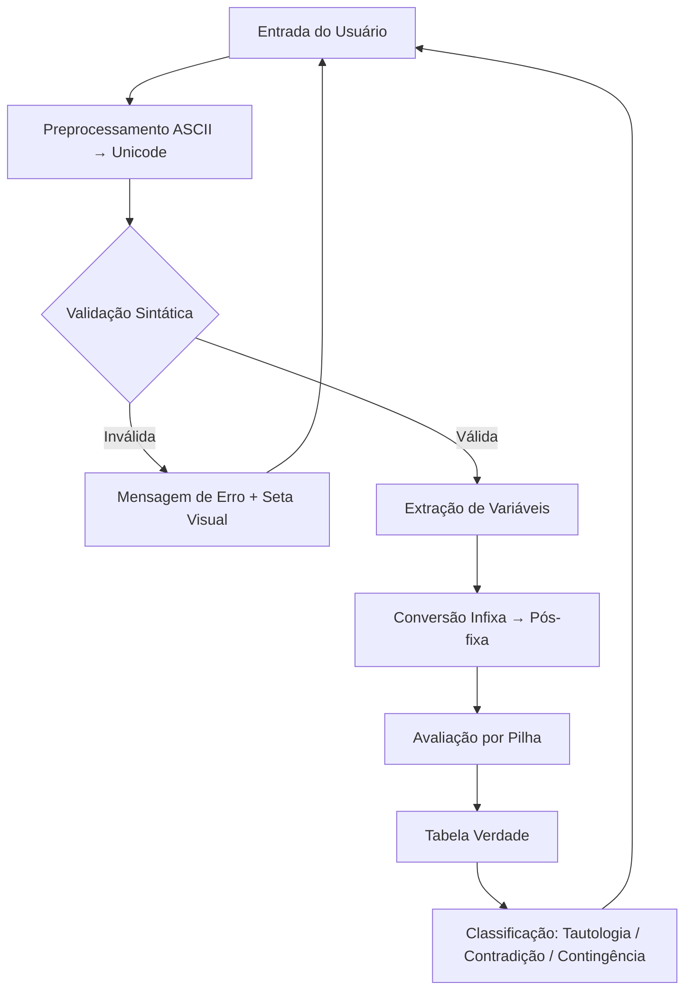

# Tabela Verdade — Gerador de Tabelas Verdade em Java

Um programa de console em Java que gera **tabelas verdade** para qualquer expressão da lógica proposicional, com validação completa de sintaxe e classificação automática (Tautologia, Contradição ou Contingência).

---

## Funcionalidades

- **Geração automática** de tabelas verdade para expressões com qualquer número de variáveis
- **Validação rigorosa** da expressão com **17+ tipos de erros** tratados, incluindo indicação visual da posição exata do erro
- **Classificação da expressão** como Tautologia, Contradição ou Contingência
- **Suporte a operadores ASCII e Unicode** — funciona tanto com símbolos especiais (`∧ ∨ → ↔ ¬`) quanto com o teclado padrão (`& | -> <-> !`)
- **Modo interativo** — avalie múltiplas expressões sem reiniciar o programa

---

## 🔣 Operadores Suportados

| Operador | Unicode | ASCII | Exemplo |
|---|---|---|---|
| Negação | `¬` | `!` ou `~` | `!A` |
| Conjunção (E) | `∧` | `&` | `A & B` |
| Disjunção (OU) | `∨` | `\|` | `A \| B` |
| Implicação (Se...então) | `→` | `->` ou `=>` | `A -> B` |
| Bicondicional (Se e somente se) | `↔` | `<->` ou `<=>` | `A <-> B` |

### Precedência (maior → menor)
`¬` (5) > `∧` (4) > `∨` (3) > `→` (2) > `↔` (1)

---

## Como Usar

### Pré-requisitos
- **Java 17+** (usa switch expressions e `String.repeat`)

### Compilação
```bash
javac -encoding UTF-8 src/TabelaVerdade/OperacaoLogica.java src/TabelaVerdade/Conectivo.java src/TabelaVerdade/TabelaVerdade.java -d out/
```

### Execução
```bash
java -cp out/ TabelaVerdade.TabelaVerdade
```

### Exemplo de uso
```
Digite a expressão (ex: A&B, !A|B, (A->B)<->C) ou digite 'sair' para encerrar:
(A -> B) & (B -> C)

A	B	C	R
V	V	V	| V
V	V	F	| F
V	F	V	| F
V	F	F	| F
F	V	V	| V
F	V	F	| F
F	F	V	| V
F	F	F	| V

--- Análise da Expressão ---
A expressão é uma CONTINGÊNCIA.
```

---

## Tratamento de Erros

O programa valida a expressão **antes** de processá-la, com mensagens claras e uma seta (`^`) apontando o local do problema:

```
Erro na posição 3: Dois operadores binários seguidos.
  A&|B
    ^
```

### Erros detectados

| Tipo | Exemplo | Mensagem |
|---|---|---|
| Expressão vazia | *(Enter)* | Expressão não pode ser vazia |
| Sem variáveis | `&\|()` | Deve conter pelo menos uma proposição |
| Números | `A2B` | Número '2' não é permitido |
| Caracteres inválidos | `A@B` | Caractere inválido '@' |
| Parênteses desbalanceados | `((A&B)` | Parêntese(s) aberto(s) sem fechamento |
| Parênteses vazios | `()` | Parênteses vazios '()' |
| Operadores consecutivos | `A&\|B` | Dois operadores binários seguidos |
| Proposições sem operador | `AB` | Duas proposições seguidas sem operador |
| Início/fim inválido | `&A` ou `A&` | Não pode começar/terminar com operador |
| Negação sem operando | `(!)` | Negação seguida de ')' — falta operando |

---

## 🏗️ Arquitetura

```
src/TabelaVerdade/
├── OperacaoLogica.java    # Interface funcional para operações lógicas
├── Conectivo.java         # Enum com os 5 conectivos lógicos (usando lambdas)
└── TabelaVerdade.java     # Classe principal (validação, parsing, avaliação)
```

### Fluxo do programa



### Algoritmos utilizados

- **Shunting Yard** (Dijkstra) — Converte expressão infixa para pós-fixa respeitando precedência e parênteses
- **Avaliação por Pilha** — Processa a notação pós-fixa empilhando operandos e aplicando operadores
- **Combinação Binária** — Usa bit manipulation (`1 << n`) para gerar todas as 2ⁿ combinações de V/F

---

---

## 🧪 Exemplos de Expressões

```text
A & B                       # Conjunção simples
!A | B                      # Equivalente à implicação A → B
(A -> B) <-> (!B -> !A)     # Contrapositiva (Tautologia!)
A & !A                      # Contradição
((P & Q) -> R) & (R -> (S | T))  # Expressão com 5 variáveis (32 linhas)
```

---

## 📝 Licença

Este projeto foi desenvolvido para fins acadêmicos.
